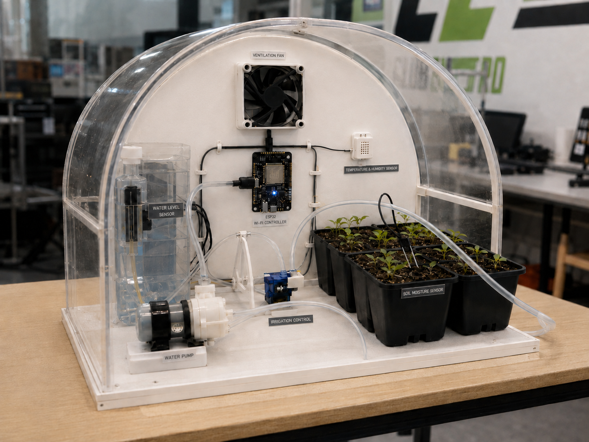
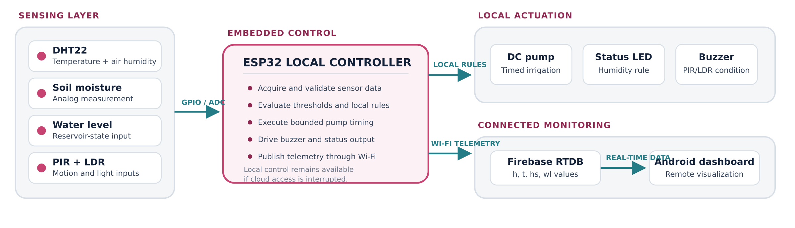
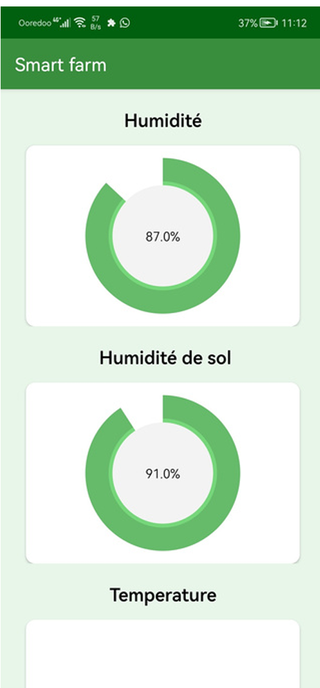

# ESP32 IoT Smart Farming System

An ESP32-based greenhouse demonstrator combining environmental sensing,
rule-based irrigation, Firebase Realtime Database telemetry, and an Android
monitoring interface.



*Presentation visualization of the greenhouse assembly. The verified embedded
interfaces are defined by the architecture and implementation scope below.*

## Project overview

This project was developed in 2022 within the Electro Scientific Club at
M'Hamed Bougara University of Boumerdes. My responsibility was the embedded
subsystem: sensor acquisition, local control logic, ESP32 firmware, Wi-Fi and
Firebase integration, and connection of the telemetry layer to the Android
dashboard.

The controller monitors greenhouse conditions and keeps the time-critical
irrigation decision on the ESP32. Cloud connectivity is used for monitoring;
the pump timing and local outputs do not depend on the mobile interface.

## System architecture



The data and control flow is divided into four layers:

1. **Sensing:** DHT22, soil-moisture input, reservoir-level input, PIR and LDR.
2. **Embedded control:** sensor validation, threshold evaluation, bounded pump
   timing, alarm/status logic, and telemetry publishing on the ESP32.
3. **Local actuation:** DC water pump, buzzer, and status LED.
4. **Connected monitoring:** Firebase Realtime Database and an Android
   dashboard.

The editable vector version is available in
[`docs/architecture.svg`](docs/architecture.svg).

## Verified implementation scope

| Subsystem | Implemented function |
| --- | --- |
| Controller | ESP32 using the Arduino framework |
| Climate sensing | DHT22 temperature and relative-humidity acquisition |
| Soil sensing | Analog soil-moisture acquisition with a configurable threshold |
| Reservoir sensing | Digital water-level/state input and telemetry |
| Irrigation | Rule-based DC pump command with bounded ON and cooldown intervals |
| Local monitoring | PIR/LDR alarm condition, buzzer output, and humidity status LED |
| Connectivity | Wi-Fi station mode and Firebase Realtime Database writes |
| Mobile interface | Android visualization of air humidity, soil moisture, and temperature |

The current firmware publishes four values that preserve compatibility with the
original application:

| Firebase path | Value |
| --- | --- |
| `/h` | Air humidity (%) |
| `/t` | Air temperature (°C) |
| `/hs` | Raw soil-moisture reading |
| `/wl` | Reservoir-level state |

## Firmware design

The consolidated firmware is located at:

[`firmware/smart_farming_esp32/smart_farming_esp32.ino`](firmware/smart_farming_esp32/smart_farming_esp32.ino)

Key implementation decisions include:

- Non-blocking `millis()`-based pump state management.
- Validation of DHT22 readings before control or cloud publication.
- Local actuation that remains available during a cloud interruption.
- Separate intervals for sensor sampling, irrigation timing, and telemetry.
- ADC1 pins for analog measurements used while Wi-Fi is active.
- Credential placeholders to prevent Wi-Fi and Firebase secrets from being
  committed.

### Pin assignment

| Signal | ESP32 GPIO | Direction |
| --- | ---: | --- |
| DHT22 | 4 | Digital input |
| Water-level state | 34 | Digital input |
| Soil-moisture signal | 35 | Analog input (ADC1) |
| PIR | 27 | Digital input |
| LDR | 33 | Analog input (ADC1) |
| Pump command | 26 | Digital output |
| Buzzer | 13 | Digital/PWM output |
| Status LED | 5 | Digital output |

GPIO 33 replaces the original ADC2-connected LDR pin because ESP32 ADC2 cannot
be relied on while Wi-Fi is active. GPIO 27 replaces boot-strapping GPIO 12 for
the PIR input.

## Android monitoring interface

<p align="center">
  
</p>

The application reads Firebase-backed measurements and presents greenhouse
telemetry remotely. It is a monitoring interface; deterministic irrigation and
alarm decisions remain on the ESP32.

## Build and configuration

### Requirements

- ESP32 development board
- Arduino IDE with ESP32 board support
- [DHT sensor library by Adafruit](https://github.com/adafruit/DHT-sensor-library)
- Firebase ESP32 Client library by Mobizt, compatible with
  `FirebaseESP32.h`

### Setup

1. Open `firmware/smart_farming_esp32/smart_farming_esp32.ino` in Arduino IDE.
2. Install the ESP32 board package and the required libraries.
3. Replace the Wi-Fi and Firebase placeholders in the local working copy.
4. Calibrate `SOIL_IRRIGATION_THRESHOLD` and `LDR_ACTIVITY_THRESHOLD` using
   the actual sensor circuits.
5. Verify the output-driver electronics before connecting the pump or buzzer;
   do not power inductive loads directly from an ESP32 GPIO.
6. Select the correct ESP32 board and serial port, then compile and upload.

> **Security:** never commit real Wi-Fi passwords, Firebase credentials, API
> keys, or database URLs. Credentials present in historical sketches should be
> rotated before the project is used again.

## Validation boundary

The supplied project material documents an assembled greenhouse prototype,
embedded firmware, Firebase data paths, and an Android monitoring interface.
This supports prototype-level validation of sensor acquisition, local
pump/output logic, and remote telemetry.

No sensor-calibration procedure, long-duration crop trial, water-use
comparison, control-accuracy measurement, or quantified reliability result was
available. The consolidated firmware in this repository has been syntax-checked
but has not yet been re-flashed and revalidated on the original hardware.

## Proposed architecture evolution — not yet implemented

- Migrate to ESP32-S3 with ESP-IDF/FreeRTOS tasks, watchdogs, persistent
  setpoints, and explicit fault states.
- Replace direct database coupling with MQTT v5 over TLS, device identities,
  buffered telemetry, and signed OTA updates with rollback.
- Add calibrated RS-485/Modbus sensor and actuator nodes, pump-current or flow
  feedback, and reservoir interlocks for multi-zone operation.
- Collect labelled time-series data before introducing irrigation
  recommendations or anomaly detection; retain pump limits and fail-safe
  decisions on the microcontroller.

## Portfolio case study

The two-page engineering portfolio section is available here:

[`docs/portfolio/smart-farming-portfolio-section.pdf`](docs/portfolio/smart-farming-portfolio-section.pdf)

## Repository structure

```text
.
├── firmware/
│   └── smart_farming_esp32/
│       └── smart_farming_esp32.ino
├── docs/
│   ├── architecture.svg
│   ├── images/
│   │   ├── android-dashboard.png
│   │   ├── architecture.png
│   │   └── system-layout.png
│   ├── portfolio/
│   │   └── smart-farming-portfolio-section.pdf
│   ├── hardware-and-connections.md
│   └── validation-and-scope.md
├── .gitignore
└── README.md
```

## Author

**Tinhinene Boumerdassi**  
Embedded Systems & Electronics Engineer  
[Portfolio](https://tina-boumerdassi-portfolio.framer.website/)

